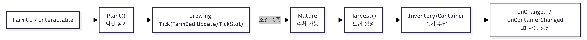

## Goal
농사 루프(심기 → 성장 → 물/비료 → 수확)를 슬롯 단위 상태머신으로 안정적으로 운영한다.
성장 규칙(시간/물 요구/단계 전환)을 FarmDB 데이터로 분리해 “작물 추가 = 테이블 추가” 중심으로 확장한다.
비주얼은 Addressables로 로딩하되, 단계 전환이 잦아도 취소 토큰으로 중복 로딩/경합을 방지한다.
UI/상호작용은 OnChanged 이벤트로 연결해 로직 ↔ UI 결합도를 낮춘다.

## System Overview

FarmBed: 8개 슬롯 Tick / API 제공(Plant/Water/Fertilize/Harvest/Uproot)

CropSlot: 슬롯 상태 데이터(작물ID, stageIndex, stageTimer, wateredCount, fertilizerRemain, multiplier…)

FarmDB: cropId → stages(needTime, needWater, prefabKey) 데이터 제공

FarmPrefabProvider(Addressables): prefabKey로 단계 비주얼 instantiate/release

UI(SeedList/SlotHighlight 등): FarmBed.OnChanged 구독해서 표시만 갱신

FarmBed가 “상태(슬롯)”를 Tick하고, DB로 “규칙”을 가져와 진행시키고, 비주얼/UI는 이벤트로 따라오게 만든 구조